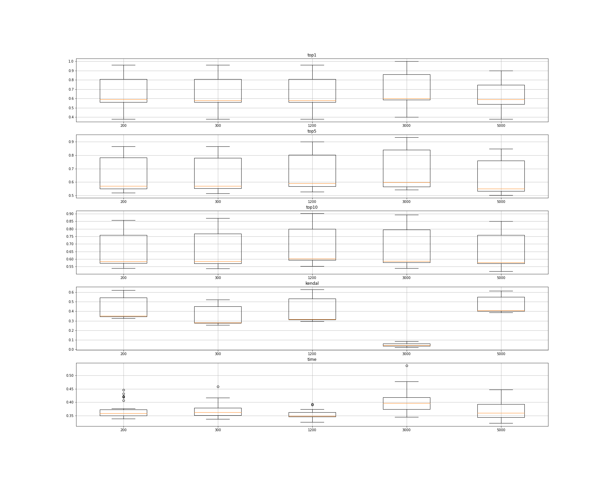
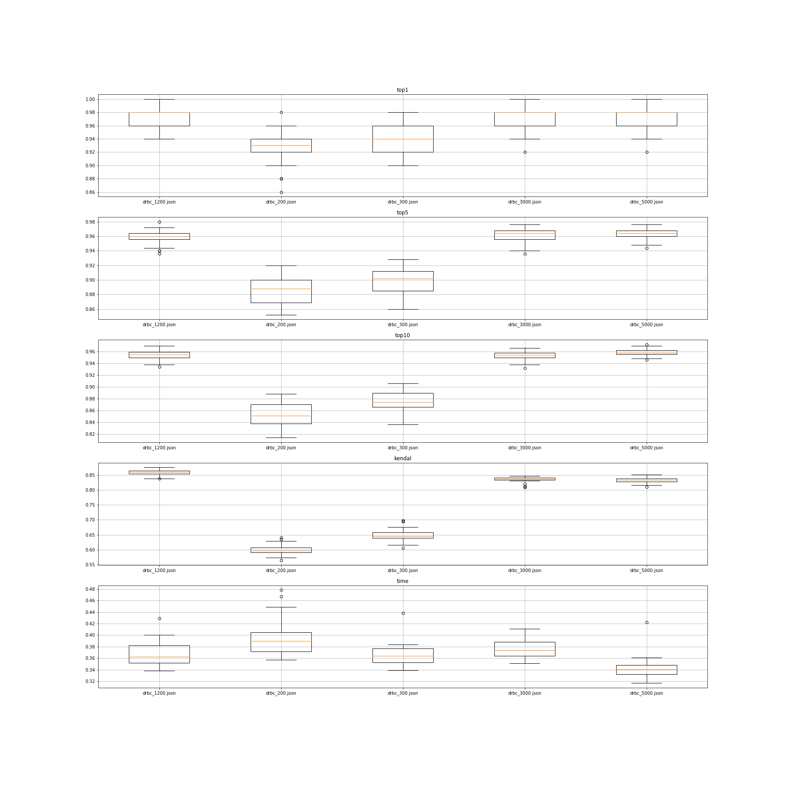

# Setting
- loss: BCELoss
- GT: sigmoid(bc[det] - bc[src])
- PR: sigmoid(bc[det] - bc[src])
- Save model based on best validation evaluation of top 10

# Train procedure

# Test Result
- CPU

## Synthetic 5000
- [data link](./../hw1_data/Synthetic/5000)

| Scale | top-1% | top-5% | top-10% | Kendal | Time(s) |
|----|----|----|----|----|----|
| 200 |  0.93±0.03      | 0.88±0.02     | 0.85±0.02     | 0.60±0.01     | 0.40±0.01     |
| 300 | 0.94±0.02 | 0.90±0.02     | 0.88±0.02     | 0.65±0.02    | 0.37±0.02     |
| 1200 | 0.97±0.02 | 0.96±0.02     | 0.95±0.01     | 0.86±0.01     | 0.37±0.02     |
| 3000 | 0.97±0.02 | 0.96±0.01     | 0.96±0.01     | 0.85±0.01     | 0.41±0.03     |
| 5000 | 0.97±0.02 | 0.96±0.01     | 0.96±0.01     | 0.81±0.01     | 0.38±0.08     |

## youtube
- [data link](./../hw1_data/youtube)

| Scale | top-1% | top-5% | top-10% | Kendal | Time(s) |
|----|----|----|----|----|----|
| 200 |  0.60      | 0.43     | 0.44     | 0.07     | 96.98     |
| 300 | 0.62 | 0.45     | 0.37     | 0.06     | 91.86    |
| 1200 | 0.68 | 0.44     | 0.35     | 0.54     | 86.39     |
| 3000 | 0.59 | 0.23     | 0.15     | -0.26     | 108.97     |
| 5000 | 0.61 | 0.21     | 0.11     | -0.51    | 90.04     |

## Amazon
| Scale | top-1% | top-5% | top-10% | Kendal | Time(s) |
|----|----|----|----|----|----|
| 200 |        |             |       |       |       |
| 300 |          |           |       |       |      |
| 1200 | 0.79 | 0.73     | 0.53     | 0.53     | 221.65     |
| 3000 |         |     |     |      |      |
| 5000 | 0.80 | 0.33     | 0.17     | -0.44    | 212.75     |